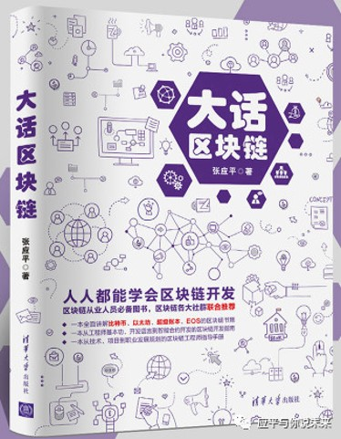

# blockchaintutorial

>大话区块链

## 内容简介
本书是一本理论与实战并重、通俗易懂又不失专业的区块链书籍。区块链技术指南部分（前三章）主要讲解了区块链概念、区块链应用和比特币、以太坊、超级账本、EOS等主流区块链技术，通过学习每个读者都可以全面理解主流区块链技术实现原理，了解区块链未来发展趋势。开发实战部分（后两章）从区块链基本技能开始，模拟真实区块链项目开发，详细讲解了智能合约和DAPP的设计、开发以及部署，通过学习每个读者都可以掌握区块链开发。

## 本书内容
为了保证本书的专业性，所有概念都来源国内外权威资料以及作者长期的思考和实践；为了使得更多人都可以理解区块链，我使用了大量例证、类比、案例，以保证内容的可读性；为保证内容的系统性，本书囊括了区块链技术指南（前三章）和区块链开发实战（后两章）两部分内容，设计了六大核心模块，分别是重新认识区块链、区块链应用探索、区块链大厦的基石、区块链工程师的基本能力、智能合约及DAPP开发实战。

第一章重新认识区块链章节，详细完整地讲解了区块链的历史、概念、核心技术和分类，通过这些内容希望大家可以快速建立区块链技术的全貌，方便后续进一步深入地学习。

第二章区块链应用探索章节，主要讲解大家最关心的话题——区块链能干什么？这个章节我从区块链的商业价值、应用原则出发，讲解了区块链的发展现状和未来发展趋势，与大家一起探索区块链在商业中的应用价值。通过这些内容让大家认识到区块链世界里到底有哪些机会？区块链应用率先会在哪些领域出现？哪些行业会被区块链颠覆？哪些领域存在着巨大的创业机会？
理解了区块链技术，也知道了区块链能干什么，接下来就需要了解区块链技术的发展现状和未来发展趋势，只有这样我们才能做到心中有数，才能根据区块链技术的实际情况来指导具体行动，避免盲目跟风以至于错失良机。

第三章区块链大厦的基石章节，通过对比特币、以太坊、超级账本Fabric、EOS、IPFS、IOTA等主流区块链技术的学习，方便大家理解区块链技术的发展脉络以及区块链现阶段存在的问题和未来发展趋势。希望大家能够把握趋势，在问题中寻找属于自己的机会。

前三章，从知识的角度大家对区块链已经有了比较全面且深入的理解。第四和第五章节重点讲解区块链开发实战。
第四章主要讲解区块链工程的基本能力。任何一项看似高深的技能都是由许多基本技能组成，掌握主流区块链实现原理，熟悉常用工具，掌握一门开发语言，你可以成为区块链工程师。

第五章采用实际案例，从项目需求、设计、开发、测试、部署详细讲解区块链开发，并从技能角度以公链以太坊和联盟链超级账本Fabric为例讲解怎样进行区块链开发，实实在在模拟一个真实的区块链项目。

## 本书代码
### 使用Node.js构建区块链
[MyBlockchain/myblockchain.js](./MyBlockchain/myblockchain.js)

### 基于以太坊构建投票 DAPP
[election/contracts/Election.sol](./lection/contracts/Election.sol)
[election/src/index.html](./election/src/index.html)

### 基于超级账本开发智能合约  
[fabric/sacc.go](./fabric/sacc.go)

## 购买链接 

[京东](https://item.jd.com/12719282.html)

[当当](http://product.dangdang.com/27950523.html)

